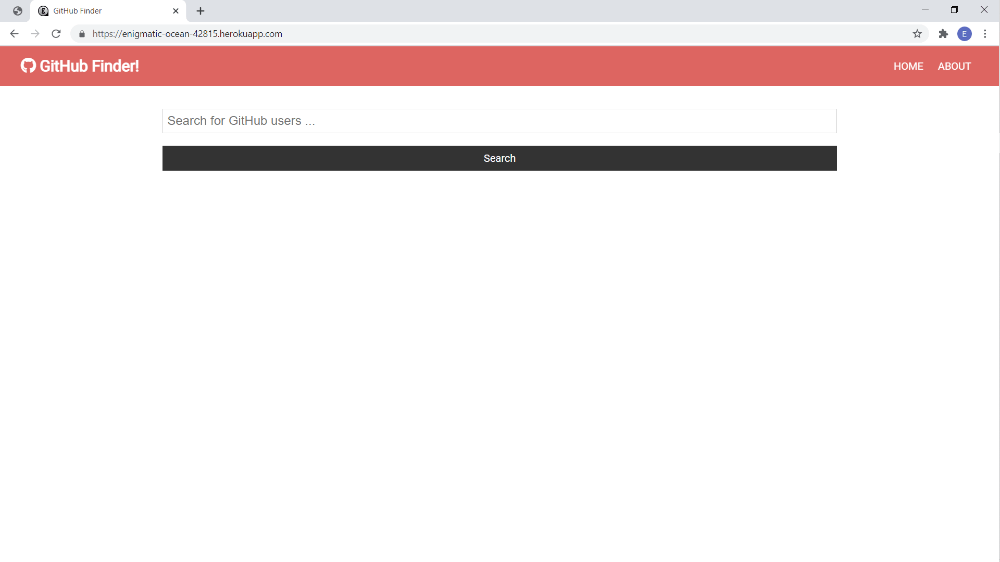
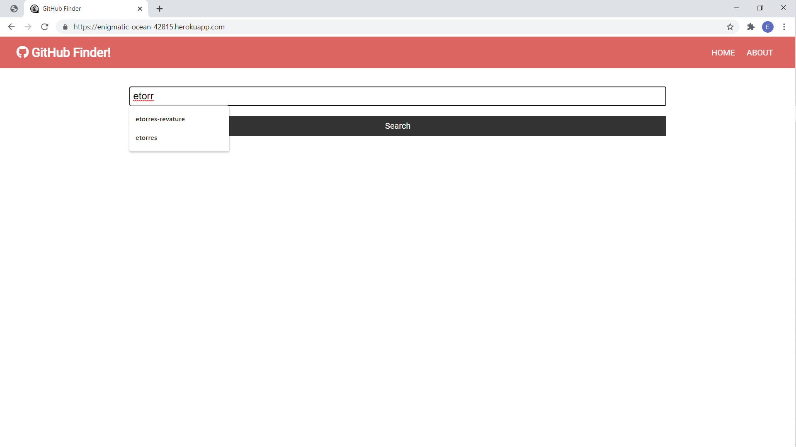
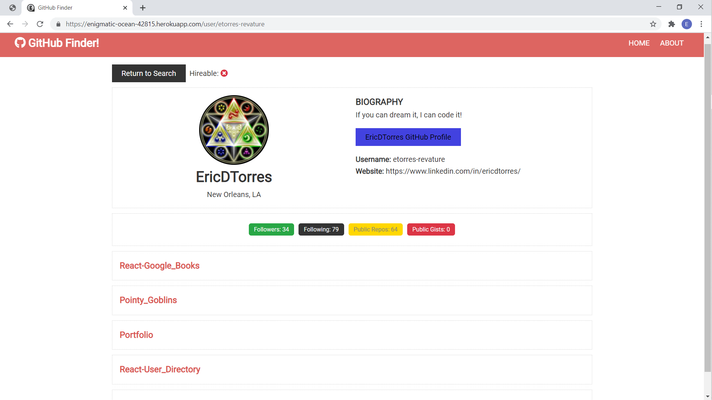
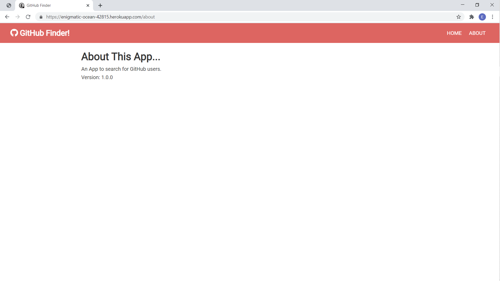

# Github Finder

## Project Description

This app is designed to search the [Github API](https://docs.github.com/en/free-pro-team@latest/rest) for user information and display the information dynamically using [React.js](https://reactjs.org/).

The [axios npm package](https://www.npmjs.com/package/axios) is used to make calls to the Github API.

Client-side routing is provided by the [react router](https://reactrouter.com/web/guides/quick-start).

Server-side routing is provided with [Express.js](https://expressjs.com/).

The development environment was [Node.js](https://nodejs.org/en/).

The app is deployed using the [gh-pages npm package](https://www.npmjs.com/package/gh-pages) as well on [heroku](https://www.heroku.com/).

## Table of Contents

- [Title](#project-title)
- [Description](#project-description)
- [Table of Contents](#table-of-contents)
- [Installation](#installation-instructions)
- [Usage](#usage)
- [Contributing](#guidelines-for-contributing)
- [Tests](#tests)
- [Technologies](#technologies-used)
- [Author](#author)
- [Questions](#questions)
- [License](#license)

## Installation Instructions

If you would like a copy of this application for your own use the [Github Finder repository](https://github.com/etorres-revature/Github_Finder) can be cloned/forked.

## Usage

Github Finder is deployed to gh-pages and heroku. [Github Finder gh-pages deployment](https://etorres-revature.github.io/Github_Finder/). [Github Finder heroku deployment](https://enigmatic-ocean-42815.herokuapp.com/).

The [Github Finder](https://enigmatic-ocean-42815.herokuapp.com/) Home Page has a text input for searching Github users and a button to submit those searches.

Users can type in the text input and push the button to submit those searches to the Github API.

Once the Github API call is made, the information returned is dynamically displayed to represent each Github user account returned by the search.

When the "more" button is pushed on a card, the associated Github user account information is displayed. The page

## Guidelines for Contributing

If you have ideas for improvements or suggestions for further features, please e-mail the address below. The user's picture, name, location, biography, link to github profile, username, and linked in URL are displayed prominently. Below that are badges for the user's followers, following, public repos, and public gists. Finally, there are links to some of the user's most recent repositories:

React creates a Single Page Application(SPA). With conditional rendering and the react router the SPA appears to have multiple pages.

## Tests

Test early; test often.

### Technologies Used

### :computer: :computer: :computer: :computer: :computer: :computer:

#### :memo: HTML5 :memo:

**HTML5** is a markup language used for structuring and presenting content on the World Wide Web. The goals are to improve the language with support for the latest multi-media and other new features; to keep the language both easily readable by humans and consistently understood by computers and devices; and to remain backward compatible to older software. Many new symantec features are included.

_HTML5_ content borrowed from <a target="_blank" rel="noopener noreferrer">[this page](https://en.wikipedia.org/wiki/HTML5).</a>

#### :art: CSS :art:

**Cascading Style Sheets (CSS)** is a stylesheet language used for describing the presentation of a document written in a markup language (such as HTML5). CSS is designed to enable the separation of presentation and content; including layout, colors, and fonts. This separation improves content accessibility to provide more flexibility and control in the specification of presentation characteristics, enabling multiple web pages to share formatting by specifying relevant CSS in a separate file, which reduces complexity and repetition in the structural content (HTML), as well as enabling the file to be cached to improve the page load speed between the pages that share the file and its formatting.

Separation of formatting and content also makes it feasible to present the same markup page in different styles for different rendering methods, such as on-screen, in print, by voice, and on Braille-based tactile devices.

_CSS_ content borrowed from <a target="_blank" rel="noopener noreferrer">[this page](https://en.wikipedia.org/wiki/Cascading_Style_Sheets).</a>

#### :sparkler: JavaScript :sparkler:

**JavaScript (JS)** is one of the core technologies of the World Wide Web (along with HTML and CSS). It enables interactive web pages and is an essential part of web applications. JS is a multi-faceted, scripting language that provides versatility through Application Programming Interfaces (APIs) and Document Object Model (DOM) manipulation, among others.

_JavaScript_ content borrowed from <a target="_blank" rel="noopener noreferrer">[this page](https://en.wikipedia.org/wiki/JavaScript).</a>

#### :globe_with_meridians: NODE.js :globe_with_meridians:

**NODE.js** is an open-source, cross-platform JavaScript runtime environment that execute JavaScript code outside a web browser. NODE.js lets developers use JavaScript to write command line tools and for server-side scripting. NODE.js represents a "Javascript everywhere" paradigm, unifying web-application development around a single programming language, rather than different programming languages for server- and client-side scripts.

_NODE.js_ content borrowed from <a target="_blank" rel="noopener noreferrer">[this page](https://en.wikipedia.org/wiki/Node.js).</a>

[Download Node.js](https://nodejs.org/en/).

#### :satellite: Express.js :satellite:

**Express.js** is a minimal and flexible NODE.js web application framework that provides a robust set of features for web and mobile applications. The myriad HTTP utility methods and middleware allow for the creation of a robust API. Express.js provides a thin layer of fundamental features, without obscuring NODE.js features.

_Express.js_ content borrowed from <a target="_blank" rel="noopener noreferrer">[this page](https://expressjs.com/).</a>

#### :dizzy: React.js :dizzy:

**React.js** is an open source JavaScript library that is used for building interfaces for single-page applications, which handles the view layer for web and mobile apps. React allows for the creation of reusable UI components. This allows developers to create large web applications that change data, without reloading the page.

_React.js_ content borrowed from <a target="_blank" rel="noopener noreferrer">[this page](https://www.c-sharpcorner.com/article/what-and-why-reactjs/#:~:text=It's%20used%20for%20handling%20the,to%20create%20reusable%20UI%20components.&text=React%20allows%20developers%20to%20create,fast%2C%20scalable%2C%20and%20simple.).</a>

### Author

This _Github Finder_ was built by :green_heart: Eric D. Torres :green_heart:

## Questions

Check out my [GitHub profile](https://github.com/etorres-revature).

You can contact me by e-mail at etorresnotary@gmail.com for any additional questions and/ or clarifications you may need about the project.

##### License

[This application uses the **MIT License** found here](./LICENSE).

**[This README.md file generated with my NODE.js README Generator app.](https://github.com/etorres-revature/NODEjs_README.md_Generator)**
